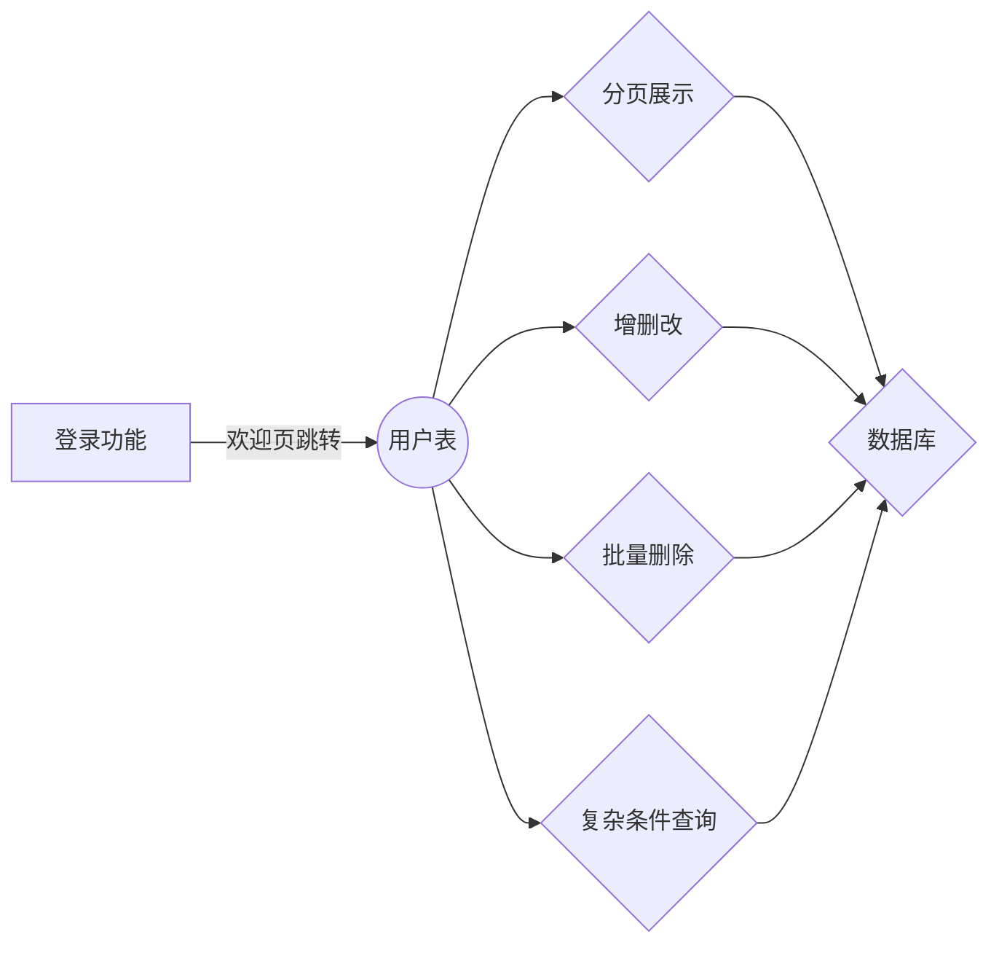

# 关于该项目

这是基于springboot框架的简易项目：用户管理系统，主要由**springboot2.3.7**、**mybatis-plus3.4.2**、**mysql5.1.49**以及前段模板引擎**thymeleaf**完成。 

# 大致结构

## 注意

该版本为原项目以springboot重构后的版本，若是想要学习的人，可以下载**初始版本**以及**空项目**进行对照。
